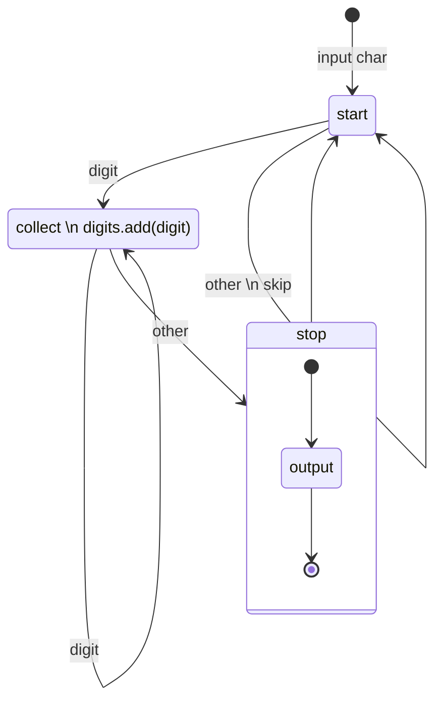

```mermaid
stateDiagram-v2
    [*] --> start : input char
    start --> collect : digit
    start --> start : other \n skip
    collect --> collect : digit
    collect --> stop : other
    stop --> start
    
    collect : collect \n digits.add(digit)
    
    state stop {
        [*] --> output
        output --> [*]
    }
```